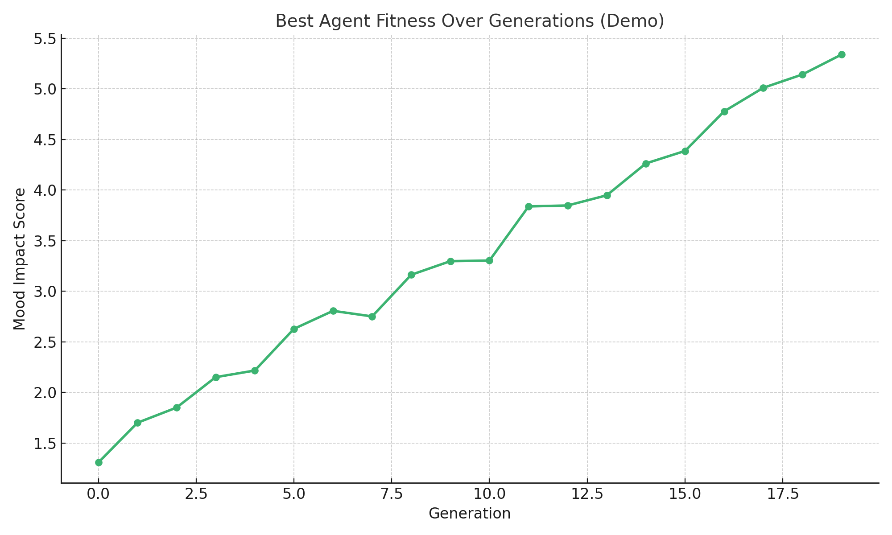

# 😊 Mood Optimization Swarm API
**Evolves AI personalities for better conversations**

## 🚀 How It Works
- Creates agents with random traits (tone, response style, timing)
- Mutates top performers each generation
- Scores agents on mood impact
- Visualizes evolutionary progress

## 📆 Files
- `voice_agent.py`: Core logic for agent traits, mutation, and fitness evaluation
- `mood_swarm.py`: Evolutionary simulation and plotting
- `requirements.txt`: Python dependencies
- `swarm_demo.png`: Fitness graph image

## ✨ Demo


## 🔧 Usage
```bash
# Install dependencies
pip install -r requirements.txt

# Run simulation
python mood_swarm.py
```

## 🌟 Built By
Parth (17yo AI researcher)
> *No coding classes — pure instinct + AI collaboration*

## 📄 License
Free to view, not to reuse.  
For educational/demo purposes only.  
Commercial use prohibited without permission.
